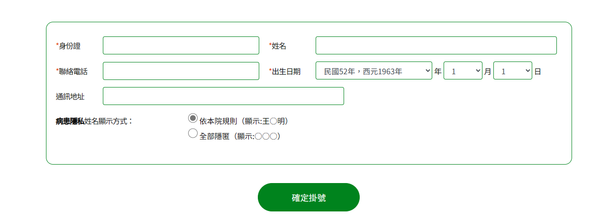

# 第2次作業-作業-HW2
>
>學號：111111224
> 
>姓名：邱武昱
> 
>作業撰寫時間：30 (mins，包含程式撰寫時間)
> 
>最後撰寫文件日期：2024/04/04

本份文件包含以下主題：(至少需下面兩項，若是有多者可以自行新增)
- [x] 說明內容
- [x] 個人認為完成作業須具備觀念

## 說明程式與內容
1.打開亞東醫院網站  
物件:我要掛號，掛號查詢，進度查詢，  
2.選取科別  
物件:外科部，骨科  
3.預約日期與醫生並掛號  
物件:我要掛號  
4.填寫資料  
物件:確定掛號  
5.填寫健康資料  
物件:身高，體重，腰圍，運動頻率  
6.預約完成  
物件:姓名，預約時間，預約醫師，就診序號，就診地點，攜帶物品，健保卡，身分證  
answer1截圖  
  
answer2截圖  

## 個人認為完成作業須具備觀念
必須了解物件導向設計的概念，要知道每張圖裡面有什麼物件，並且在畫圖時把物件之間的關係標示清楚。
